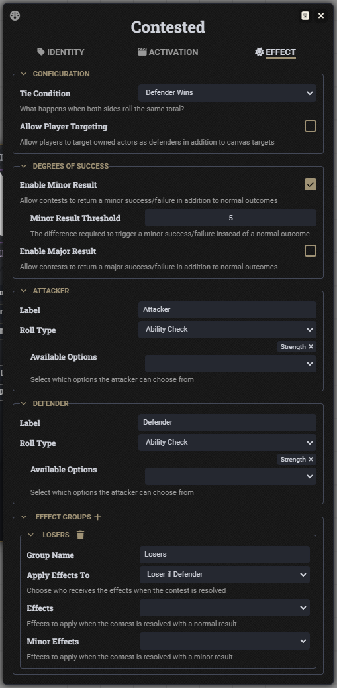
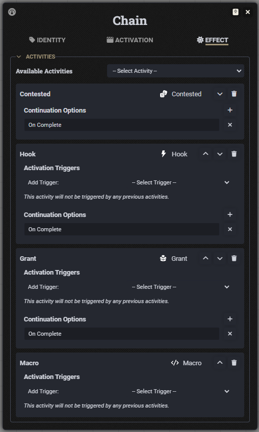
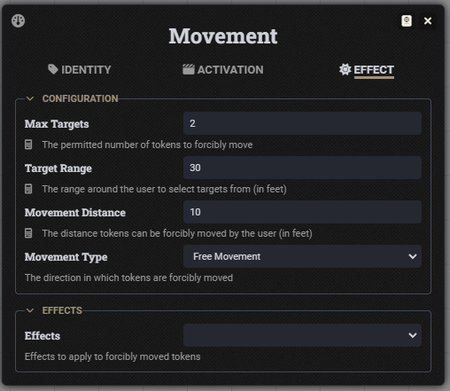
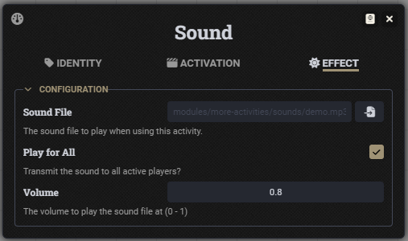
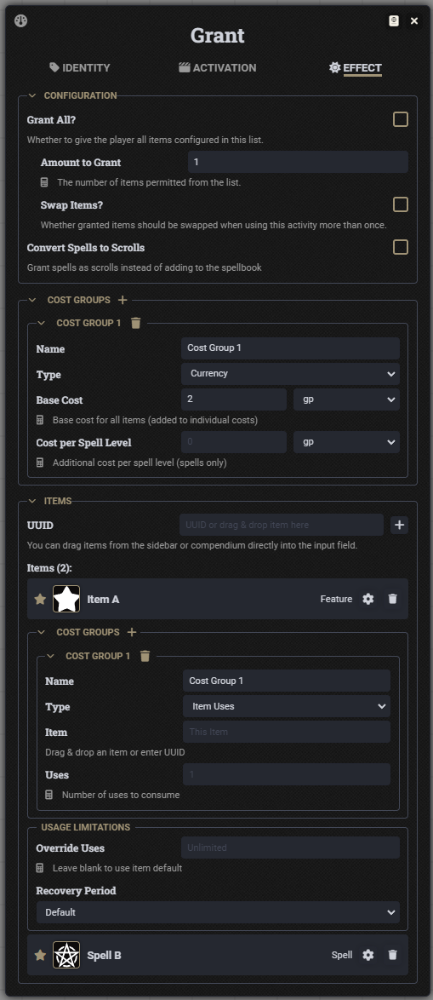
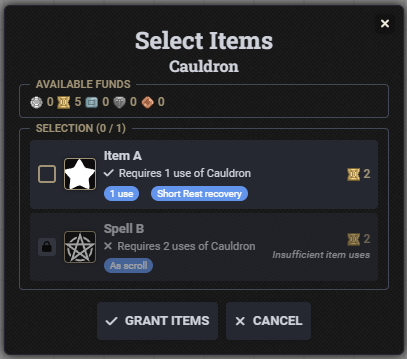

## More Activities

An extension to the D&D 5E system for FoundryVTT Version 12 and 13 that provides additional activity types.

## 🌟 Features

### ✅ Available Now

- **Macro Activity:** Inline macro code that execute when used
- **Hook Activity:** Inline macro code that execute on a specified hook
- **Contested Activity:** Dialogs that allow for configurable contested rolls
- **Chain Activity:** Chain multiple activities together with triggers
- **Teleport Activity:** Teleport tokens on the canvas
- **Movement Activity:** Force tokens to move on the canvas
- **Sound Activity:** Play sounds directly from the activity
- **Grant Activity:** Grant items or create Pact-style selections
- **Wall Activity:** Create walls directly on the canvas
- **Advancement Activity:** Trigger advancements directly from the activity

### 🍾 Versioning

**More Activities** supports both Foundry Version 12 and 13 and D&D 5E Version 4.4.4 and 5.0.0+ 🎉

## 👏 Huge Thanks

- **TogaParty:** Suggestion for *Contested* Activity
- **darkanx:** Suggestion for *Chain*, *Teleport*, *Movement*, *Grant* and *Wall* Activities
- **alterNERDtive:** Suggestion for *Advancement* Activity
- **TPNils:** Improvement for *Grant* Activity
- **ljstrings:** Improvement for *Movement* Activity
- **SRR8:** Improvements for *Grant* Activity
- **darkanx, alterNERDtive, WelpM8, WeslleyNasRocha, SRR8:** Highlighting bugs in this module

## 🚫 Breaking Changes

All future versions of **More Activities** will support migration of data structures. Eventually, old data schemas will be removed, so please review the below for substantial changes to determine if you need to upgrade incrementally, rather than directly from a sufficiently old version.

- ⚠️ **Version 1.8.1 ➡️ 1.8.2**
    - *Grant Activity:*
        - Introduction of Cost Groups to replace singular currency cost application
        - Support for old data structures will be removed in the next major release.
        - Please update to 1.9.x before proceeding to newer versions.

- ⚠️ **Version 1.7.3 ➡️ 1.8.0**
    - *Contested Activity:*
        - Introduction of Effect Groups to replace singular effect application
        - Support for old data structures will be removed in the next major release.
        - Please update to 1.9.x before proceeding to newer versions.

- 🚫 **Version 1.4.0 ➡️ 1.5.0:**
    - *Hook Activity:*
        - `dnd5e.rollAbilitySave` replaced with (correct) `dnd5e.rollSavingThrow` hook
        - `dnd5e.rollAbilityTest` replaced with (correct) `dnd5e.rollAbilityCheck` hook
        - Upgrading from v1.4.0 or older to v1.5.0 could result in breaks to the *Hook* activity

## 🚀 Quick Start

### Installation

**Option 1: Foundry Module Browser**
1. Install from FoundryVTT module browser: "More Activities"
2. Enable the module in your world
3. Add your preferred activities to items of your choice

**Option 2: Manual Installation**
1. In FoundryVTT, go to Add-on Modules → Install Module
2. Use manifest URL: `https://github.com/TTimeGaming/fvtt-more-activities/releases/latest/download/module.json`
3. Enable the module in your world
4. Add your preferred activities to items of your choice

**Basic Usage**
1. Create a new Item and navigate to the Activities tab
2. Create a new Activity and choose from one of the additional activities provided as part of this module

## 📋 Requirements

-ee9b3a?style=for-the-badge&logo=foundryvirtualtabletop&logoColor=white)
-e50712?style=for-the-badge&logo=dungeonsanddragons&logoColor=white)

## 📄 License

[MIT License](./LICENSE) - Free for personal and commercial use.

## 💖 Support This Project

Love using **More Activities**? Consider supporting continued development:

&emsp;

Your support helps fund:
- 🚀 **New Features:** Additional activities for the 5E System
- 🐞 **Bug Fixes:** Faster resolution of issues and compatibility issues
- 📚 **Documentation:** Comprehensive guides and tutorials for each and every activity
- 🎯 **Community Requests:** Implementation of user-requested features

## 📷 Screenshots

### Macro Activity

### Hook Activity

### Contested Activity

### Chain Activity

### Teleport Activity

### Movement Activity

### Sound Activity

### Grant Activity

### Wall Activity

### Advancement Activity

---

**Ready to bring even more activity options to your D&D 5E table?** Install More Activities today and help shape its development through testing and feedback!
