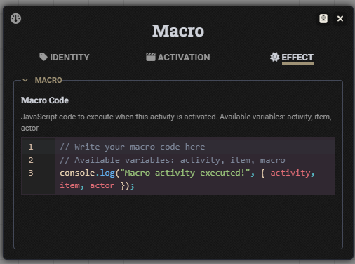

## More Activities

An extension to the D&D 5E system for FoundryVTT v13+ that provides additional activity types.

## 🌟 Features

### ✅ Available Now

- **Macro Activity:** Adds inline macro activities that execute automatically when the Activity is used.
- **Hook Activity:** Adds inline macro activities that execute on a specified hook, with support for manual usage.

### ⚠️ Current Limitations

- **Versioning:** This module only supports v13 of FoundryVTT and will not be backported.

### 🚧 Coming Soon
*There is no ETA for these features. This is a passion project and I cannot currently commit that much time to development.*

- There are currently no planned additional activities.

## 🚀 Quick Start

### Installation

**Option 1: Foundry Module Browser**
1. Install from FoundryVTT module browser: "More Activities"
2. Enable the module in your world
3. Add your preferred activities to items of your choice

**Option 2: Manual Installation**
1. In FoundryVTT, go to Add-on Modules → Install Module
2. Use manifest URL: `https://github.com/TTimeGaming/fvtt-more-activities/releases/latest/download/module.json`
3. Enable the module in your world
4. Add your preferred activities to items of your choice

**Basic Usage**
1. Create a new Item and navigate to the Activities tab
2. Create a new Activity and choose from one of the additional activities provided as part of this module

## 📋 Requirements

- **Foundry VTT:** Version 13 or higher (verified 13.346)
- **D&D 5E System:** Version 5.0.0 or higher (verified 5.0.4)

## 📄 License

[MIT License](./LICENSE) - Free for personal and commercial use.

## 💖 Support This Project

Love using **More Activities**? Consider supporting continued development:

&emsp;

Your support helps fund:
- 🚀 **New Features:** Additional activities for the 5E System
- 🐞 **Bug Fixes:** Faster resolution of issues and compatibility issues
- 📚 **Documentation:** Comprehensive guides and tutorials for each and every activity
- 🎯 **Community Requests:** Implementation of user-requested features

## 📷 Screenshots

### Macro Activity

### Hook Activity

---

**Ready to bring even more activity options to your D&D 5E table?** Install More Activities today and help shape its development through testing and feedback!
